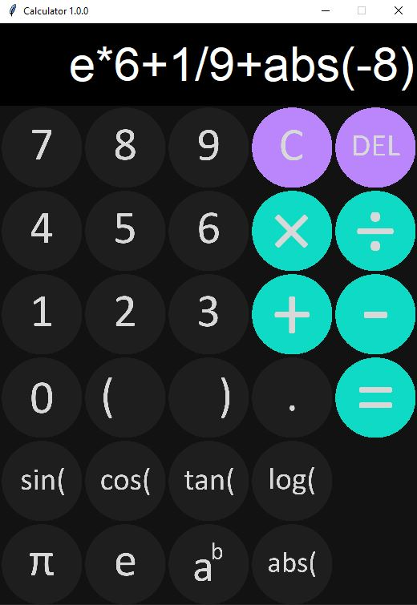

<h1>Python calculator using tkinter</h1>

This is a fun project that focuses on functionality while also incorporating a modern design using tkinter.

 

This calculator aims to support all basic operators such as addition, subtraction, division, and multiplication. While also supporting other functionality such as:

1. Brackets and decimals.

2. Sin, cos, and tan.

3. Constants such as e and pi.

4. Power and absolute values.

<h1>Screenshots</h1>

